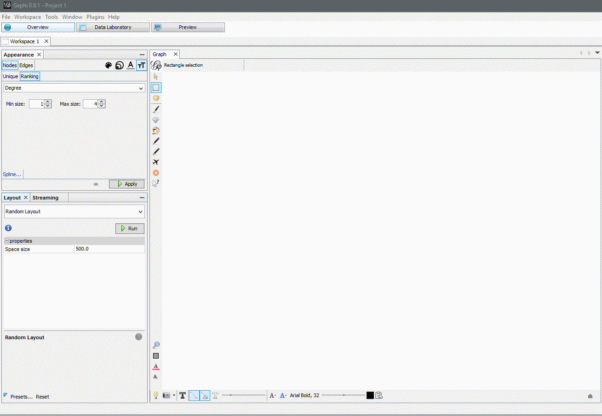

FSharpGephiStreamer  
===================

FSharpGephi streamer was accepted in [The Journal of Open Source Software (JOSS)](http://joss.theoj.org/papers/353e97af96ed27c448d32501fda34aed#) with version 1.1.6. If you use this software in your research, please cite:

> Schneider et al., (2019). FSharpGephiStreamer: An idiomatic bridge between F# and network visualization. Journal of Open Source Software, 4(38), 1445, https://doi.org/10.21105/joss.01445

F# functions for streaming any kind of graph/network data to the network visualization tool [gephi.](https://gephi.org/) <https://csbiology.github.io/FSharpGephiStreamer/>

|Branch|Ubuntu(trusty)|Windows|
|---|---|---|
| master |  |  |
| developer |  |  |

[Gephi](https://gephi.org/) is the leading visualization and exploration software for all kinds of graphs and networks. Gephi is open-source and free

FSharpGephi streamer tackles the gap between the capabilities of F# in regards of strongly typed handling of large data sets and the visualization capabilites 
of Gephi by directly connecting them to each other. It enables users to convert any type of node/edge data to gephi interpretable objects and put them into gephi through F# interactive 
without the need of any UI interaction but the starting of the streaming server.

Prerequisites
=============

A local installation of Java, Gephi and the Graph Streaming plugin is necessary. See [here](https://csbiology.github.io/FSharpGephiStreamer/InstallationInstructions.html) for more indepth installation instructions.

Documentation
=============

Functions, types and Classes contained in the FSharpGephiStreamer library come with short explanatory description, which can be found in the [API Reference](http://CSBiology.github.io/FSharpGephiStreamer/reference/index.html).

More indepth explanations, tutorials and general information about the project can be found [here](http://CSBiology.github.io/FSharpGephiStreamer/).

The documentation and tutorials for this library are automatically generated (using the F# Formatting) from *.fsx and *.md files in the docsrc folder. If you find a typo, please submit a pull request!

Contributing
============

Please refer to the [contribution guidelines](.github/CONTRIBUTING.md)

Library license
===============

The library (1.1.0+) is available under MIT. For more information see the License file in the GitHub repository.