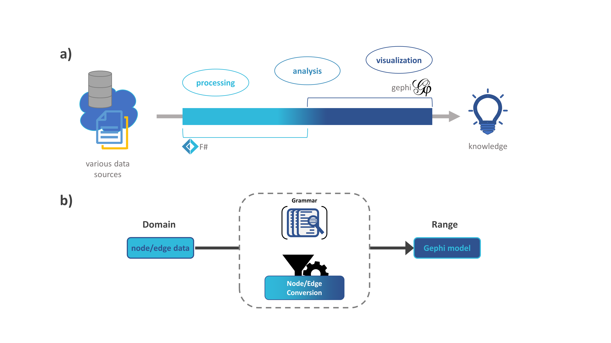

# Statement of need

Network science empowers researcher across different disciplines to study complex
relationships between a huge number of elements and reveal the underling wiring
diagram of a system. Therefore, network visualization tools have become a very
important component in various data analysis workflows [@Barabási2011]. ``Gephi`` is an
open source software for explorative analysis and visualization of large-scale networks.
It facilitates real-time visualizations and analysis to improve the exploratory process
by high quality layout algorithms and intuitive user interface [@ICWSM09154].
Due to universality of network science, their representation emerges of different data
sources from nature or society.  Therefore, the need to efficiently connect to rich
information spaces and create complex repeatable workflows exceeds the capabilities of
automation features in any point-and-click-based network visualization and analysis
software available. The functional-first programming languages F# is specialized for
type save information-rich programming and domain driven explorative programming
[@leveraging-net-meta-programming-components-from-f-integrated-queries-and-interoperable-heterogeneous-execution]
[@inforich-ddfp]. This enables data collection, processing and analysis
tasks leveraging the flexibility of the programming environments.

# Summary

We created ``FSharpGephiStreamer`` to enable automated access to the ``Gephi`` network and 
visualization models directly from within the F# interactive programming environment. 
The functional approach used for the implementation of ``FSharpGephiStreamer`` provides a 
short grammar that models the direct graph data streaming process to transfer the data 
over the ``Gephi`` Rest API. This allows an immediate insert, update or delete of 
individual graph elements directly in the ``Gephi`` network and visualization model 
without the necessity to create the network on the client side. The client-host 
communication works exception-free with error handling using error type monads. 
``FSharpGephiStreamer`` closes the gap between F# and the functionality of the ``Gephi``
software project. Hence, effectively improving the integration of ``Gephi`` into large 
scale data analysis pipelines and increasing workflow reproducibility.

# References